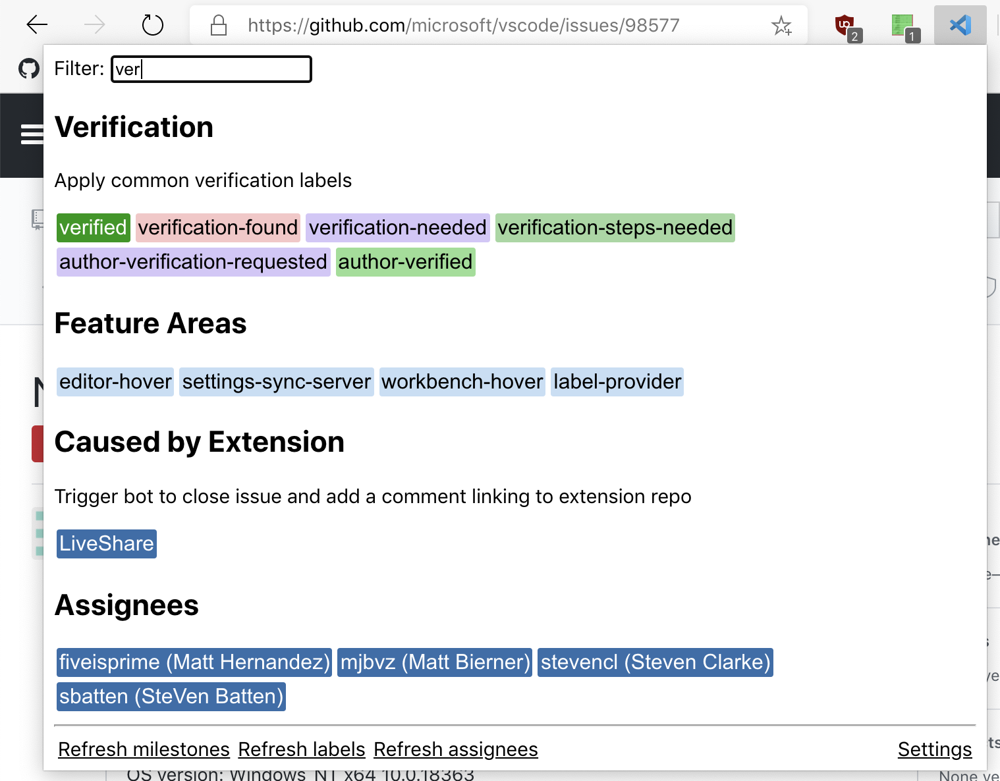

# VS Code Issue Triage Extension

This is a chromium extension to help with triaging GitHub issues. It was originally developed for our work in the [microsoft/vscode](https://github.com/microsoft/vscode) repo, but it can be used on any GitHub repo.



## Install

You can pull the latest release from the [releases page](https://github.com/microsoft/vscode-github-triage-extension/releases) and unzip it. Then, navigate to your extension configuration page (edge://extensions/, for instance), and make sure "Developer Mode" is enabled. There should be an option to "Load Unpacked". Select this, then choose the folder you unpacked earlier.

## Usage

Press Cmd+Shift+L to trigger the extension. This can be customized on your browser's extension configuration page under "Keyboard Shortcuts". (This was previously Cmd+Shift+P but changed due to conflict with Codepsaces)

Press enter in search to accept first result. Tab/ArrowKeys to move around in results. Enter/Space to accept results. Cmd with the action to multi-select.

## Configuration

Use the `Settings` link at bottom of the popup to view and edit the JSON representation of your commands. The supported file takes the form (as typescript):
```ts
type Settings = { [repo: string]: Category[] }
type Category = { category: string, description: string, items: Shortcut[] }
type Shortcut = {
	title: string
	color?: string
	type: 'label' | 'comment' | 'assign' | 'milestone'
	value: string
}
```

For instance:
```json
{
  "microsoft/vscode": [
    {
      "category": "Verification",
      "description": "Apply common verification labels",
      "items": [
        {
          "color": "rgb(0, 152, 0)",
          "title": "verified",
          "type": "label",
          "value": "verified"
        },
        {
          "color": "rgb(247, 198, 199)",
          "title": "verification-found",
          "type": "label",
          "value": "verification-found"
        }
      ]
    },
    {
      "category": "Won't Fix",
      "description": "Trigger bot to close issue and add a comment explaining why",
      "items": [
        {
          "color": "rgb(226, 161, 194)",
          "title": "*as-designed",
          "type": "label",
          "value": "*as-designed"
        }
      ]
    }
  ]
}
```
